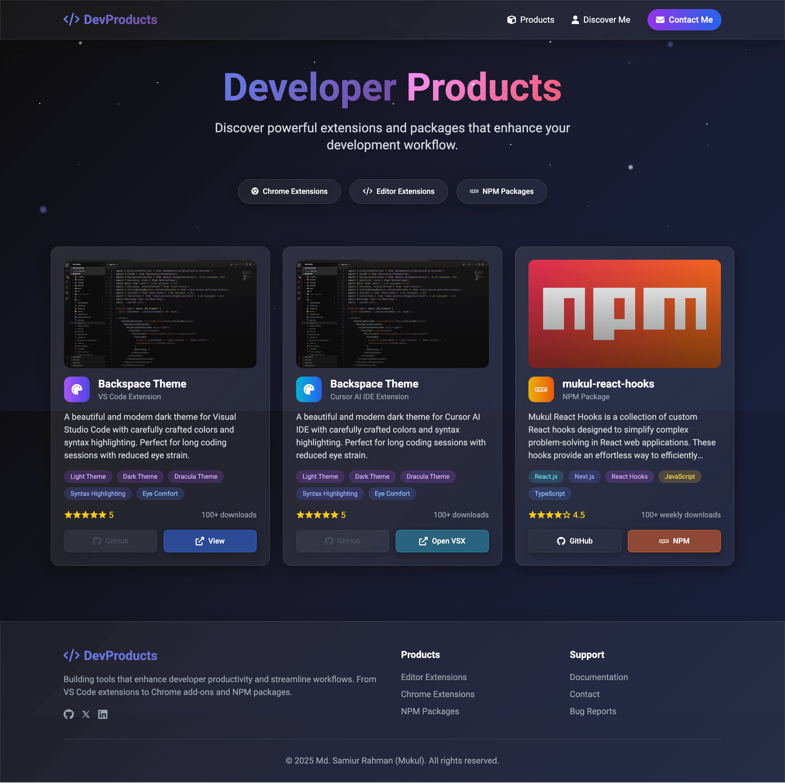

# DevProducts - Developer Tools Showcase

A modern, responsive showcase website featuring developer tools, extensions, and packages with a stunning animated starry background and glass morphism design.



## 🌟 Overview

DevProducts is a portfolio website that showcases various developer tools and extensions including:

- **VS Code Extensions** - Beautiful themes and productivity tools
- **Cursor AI IDE Extensions** - Enhanced coding experience for AI-powered development
- **NPM Packages** - Custom React hooks and utility libraries
- **Chrome Extensions** - Browser productivity enhancements

## ✨ Features

### 🎨 Design & UI

- **Glass Morphism Design** - Modern frosted glass effects with blur and transparency
- **Animated Starry Background** - Dynamic particles, stars, shooting stars, and orbital elements
- **Responsive Layout** - Optimized for all devices (mobile, tablet, desktop)
- **Smooth Animations** - CSS3 transitions and keyframe animations
- **Gradient Typography** - Eye-catching gradient text effects

### 📱 User Experience

- **Mobile-First Responsive** - Optimized for mobile devices with touch-friendly interactions
- **Smooth Scrolling** - Enhanced navigation with smooth scroll behavior
- **Interactive Elements** - Hover effects, loading animations, and visual feedback
- **Masonry Grid Layout** - Dynamic card layout that adapts to content
- **Accessible Navigation** - Keyboard navigation and screen reader support

### 🚀 Performance

- **Optimized Assets** - Compressed images and efficient CSS/JS
- **Lazy Loading** - Images load as needed for better performance
- **Intersection Observer** - Efficient scroll-triggered animations
- **Debounced Events** - Optimized scroll and resize handlers
- **Progressive Enhancement** - Works without JavaScript for core functionality

## 🛠 Technologies Used

### Frontend Stack

- **HTML5** - Semantic markup with accessibility features
- **CSS3** - Custom properties, flexbox, grid, animations
- **Vanilla JavaScript** - Modular ES6+ code with no dependencies
- **Tailwind CSS** - Utility-first CSS framework via CDN

### External Resources

- **Font Awesome** - Icons and symbols
- **Google Fonts** - Roboto font family
- **Tailwind CSS** - Responsive utility classes

## 📁 Project Structure

```bash
dev-products-webpage/
├── assets/                 # Static assets
│   ├── website-screenshot.png # Website preview screenshot
│   ├── favicon.ico        # Website favicon
│   └── npm-banner.webp    # NPM package banner
├── index.html             # Main HTML file
├── styles.css             # Custom CSS styles
├── script.js              # JavaScript functionality
├── LICENSE                # MIT License
└── README.md             # Project documentation
```

## 🚀 Getting Started

### Prerequisites

- Modern web browser (Chrome, Firefox, Safari, Edge)
- Local web server (for development)

### Installation

1. **Clone the repository**

   ```bash
   git clone https://github.com/SamiurRahmanMukul/dev-products-webpage.git
   cd dev-products-webpage
   ```

2. **Serve the website**

   **Option 1: Using Python**

   ```bash
   # Python 3
   python -m http.server 8000

   # Python 2
   python -m SimpleHTTPServer 8000
   ```

   **Option 2: Using Node.js**

   ```bash
   npx serve .
   ```

   **Option 3: Using Live Server (VS Code Extension)**

   - Install Live Server extension
   - Right-click on `index.html`
   - Select "Open with Live Server"

3. **Open in browser**

   ```url
   http://localhost:8000
   ```

## 🎯 Usage

### Adding New Products

To add a new product to the showcase:

1. **Add product HTML** in `index.html` within the masonry grid:

   ```html
   <div class="masonry-item">
     <div class="glass-card rounded-xl sm:rounded-2xl p-4 sm:p-6">
       <!-- Product content here -->
     </div>
   </div>
   ```

2. **Update product image** in the `assets/` folder

3. **Customize styling** in `styles.css` if needed

### Customizing Animations

1. **Modify star animations** in the CSS `:nth-child()` selectors
2. **Adjust animation timing** by changing CSS custom properties:

   ```css
   :root {
     --transition-fast: 0.3s ease;
     --animation-delay: 100ms;
   }
   ```

### Updating Contact Information

1. **Update links** in the navigation and footer sections
2. **Modify social media URLs** in the mobile menu
3. **Update copyright information** in the footer

## 🎨 Customization

### Color Scheme

The website uses CSS custom properties for easy theming:

```css
:root {
  /* Primary Colors */
  --color-primary-blue: #667eea;
  --color-primary-purple: #764ba2;

  /* Background Colors */
  --color-bg-dark-1: #0c0c0c;
  --color-bg-dark-2: #1a1a2e;

  /* Glass Effects */
  --color-glass-bg: rgba(255, 255, 255, 0.05);
}
```

### Typography

Font sizes and families can be customized:

```css
:root {
  --font-family-primary: "Roboto", sans-serif;
  --font-size-base: 1rem;
  --font-weight-bold: 700;
}
```

### Animations

Animation speeds and effects can be modified:

```css
:root {
  --transition-fast: 0.3s ease;
  --transition-normal: 0.5s ease;
  --blur-sm: 10px;
}
```

## 📱 Responsive Design

The website is built with a mobile-first approach:

- **Mobile (< 640px)**: Single column layout, optimized touch interactions
- **Tablet (640px - 1023px)**: Two-column masonry grid
- **Desktop (1024px+)**: Three-column masonry grid with enhanced animations

### Breakpoints

```css
/* Mobile First (default) */
@media (min-width: 640px) {
  /* Tablet styles */
}
@media (min-width: 768px) {
  /* Small desktop */
}
@media (min-width: 1024px) {
  /* Large desktop */
}
```

## 🧩 JavaScript Modules

The JavaScript is organized into modular components:

### Core Modules

- **MobileMenu** - Handles mobile navigation
- **Animations** - Manages loading and scroll animations
- **Navigation** - Smooth scrolling and anchor links
- **Performance** - Intersection Observer and optimizations
- **ErrorHandler** - Global error handling and logging

### Configuration

```javascript
const CONFIG = {
  ANIMATION_DELAY: 100,
  MOBILE_BREAKPOINT: 768,
  ENABLE_PARALLAX_ON_MOBILE: false,
  PARALLAX_SPEED: 0.5,
};
```

## 🎭 Animation System

### Background Elements

- **Stars** - Twinkling animation with random delays
- **Particles** - Floating circular elements
- **Shooting Stars** - Diagonal movement across screen
- **Rocket Trails** - Horizontal movement with glow
- **Orbital Dots** - Circular orbital motion
- **Glowing Orbs** - Pulsing gradient orbs

### Performance Considerations

- Animations are disabled on mobile for better performance
- Uses `transform` instead of changing layout properties
- Implements `will-change` for smooth GPU acceleration
- Debounced scroll and resize handlers

## 🔧 Development

### Code Style

- **ES6+ Features** - Modern JavaScript syntax
- **Modular Architecture** - Organized into logical modules
- **CSS Custom Properties** - Consistent theming system
- **Semantic HTML** - Accessible and SEO-friendly markup

### Best Practices

- Mobile-first responsive design
- Progressive enhancement
- Accessibility considerations
- Performance optimization
- Clean, maintainable code

### Testing

Test the website across different:

- **Browsers** - Chrome, Firefox, Safari, Edge
- **Devices** - Mobile, tablet, desktop
- **Screen Sizes** - Various viewport dimensions
- **Connection Speeds** - Ensure fast loading

## 🤝 Contributing

Contributions are welcome! Please follow these steps:

1. **Fork the repository**
2. **Create a feature branch**

   ```bash
   git checkout -b feature/amazing-feature
   ```

3. **Commit your changes**

   ```bash
   git commit -m 'Add some amazing feature'
   ```

4. **Push to the branch**

   ```bash
   git push origin feature/amazing-feature
   ```

5. **Open a Pull Request**

### Contribution Guidelines

- Follow existing code style and conventions
- Test changes across different devices and browsers
- Update documentation for significant changes
- Ensure accessibility standards are maintained

## 📄 License

This project is licensed under the MIT License - see the [LICENSE](LICENSE) file for details.

## 👨‍💻 Author

### Md. Samiur Rahman (Mukul)

- Website: [srmukul.com](https://srmukul.com)
- GitHub: [@SamiurRahmanMukul](https://github.com/SamiurRahmanMukul)
- Twitter: [@SamiurRahMukul](https://x.com/SamiurRahMukul)
- LinkedIn: [SamiurRahmanMukul](https://www.linkedin.com/in/SamiurRahmanMukul)

## 🙏 Acknowledgments

- **Tailwind CSS** - For the utility-first CSS framework
- **Font Awesome** - For the beautiful icons
- **Google Fonts** - For the Roboto font family
- **Design Inspiration** - Modern glass morphism and space themes
- **Community** - For feedback and suggestions

## 📊 Project Stats

- **Lines of Code**: ~2000+ (HTML, CSS, JS combined)
- **File Size**: Optimized for web performance
- **Browser Support**: Modern browsers (ES6+ support)
- **Mobile Optimized**: 100% responsive design
- **Accessibility**: WCAG 2.1 AA compliant

---

**⭐ Star this repository if you found it helpful!**

For questions, suggestions, or collaboration opportunities, feel free to reach out through any of the contact methods above.
